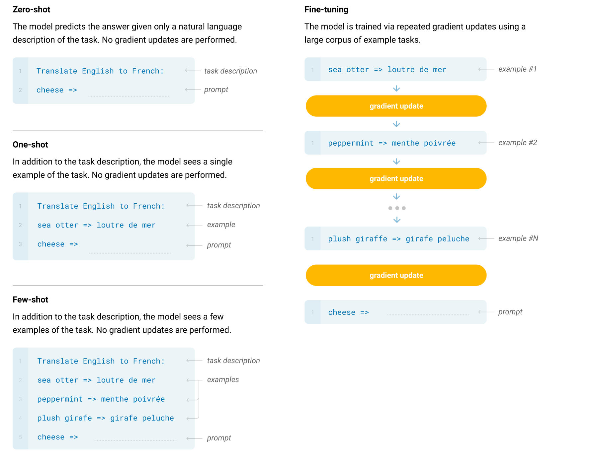

# 499G1/590G1 Final Project Report

## Abstract
Large pretrained language model has gained more and more attention in recent years. Not only because of their representation power and superior performance with traditional fine-tuning on various dataset, but its ability of generalizing to new tasks with "in-context learning" also opened another path of Natural Language Processing (NLP) research.

There have been various techniques proposed to improve the performance under prompting setup. Those techniques are generally referred to as "prompt engineering". Motivated by a recent paper [2], in this project we test various aspects of prompt to see what matters for the performance of in-context learning, and successfully reproduce most of the results in the original paper with finding several surprising results.

## Introduction
As demonstrated first in the GPT3 paper published by OpenAI [1], the large language model (here we are talking about the model that is in the scale of a few hundred million parameters to a few hundred billion parameters) that is pretrained on the general auto-regressive language modeling objective can achieve state-of-the-art performance on various downstream tasks **without** updating any parameters. The techniques to achieve such results, referred to as "in-context learning" or "prompting", attracted lots of research attention due to its simplicity, sample efficiency, and memory efficiency.
 
In-context learning is usually discussed under the context of few-shot learning or zero-shot learning. Given a downstream task, in the zero-shot setup, we will prepend a string of task description to the input $x$; while in the few-shot setup, we will prepend a list of ( $x_i$ , $y_i$ ) pair to the input $x$. An example of in-context learning in both setups is illustrated in the figure below.

 

In this project, we are interested in the arguments and results claimed in [2], which states that the input-output mapping is actually **not** important. i.e.: the prompts could contain wrong examples and still achieve high performance. What actually matters is the distribution of the input text (the $x_i$ part in the prompt) and the label space (does the prompt contain all labels and only all the labels we can possibly have in the dataset). This is an interesting finding since usually we would think the input-label mapping is important as it demonstrates to the model how to do the task. Another work we focused on is [4], which claimed that the input distribution could be irrelevant. This seems to contradict with the result in [2], thus we also reproduced experiments in [4] to verify its claim.

## Related Works
TThe related works, which are usually referred to as "prompt engineering", aim to find a general way to design the prompt for different downstream tasks. The main idea for our project came from the paper “Rethinking the Role of Demonstrations: What Makes In-Context Learning Work?” [2], where researchers studied what aspects of the demonstrations help the model learn and improve its performance on the final task. Specifically, we want to perform some experiments on (1) input distribution, (2) output distribution, (3) input-output mapping, and (4) formatting to study how the input distributions and output distributions affect the performance of the model for in-context learning, following the idea
from [2]. [3] provides a great review of the literature in this field. Besides designing better prompts to improve performance, understanding what is important and what contributes to the in-context "learning" behavior is another important topic. Papers like [2] and [4] did ablation on various perspectives of prompt designs and conclude that some parts of the prompt are more important than others. The code we adopted came from [github repo](https://github.com/Alrope123/rethinking-demonstrations).

## Methodology
In this project, we mainly focus on reproducing the result from [2] and [4]. Since we are only interested in in-context learning performance, there is no model training involved and we directly take pretrained model on Huggingface for evaluating the performance.
##### Input-label mapping
In this part, we shuffled the label for each sample in the demonstrations based on the random seed to generate data for the "random label" test. The gold label and no demo data can be obtained from the original data. For the experiments of this part, we fixed the input text but replaced the label of each demonstration with a random label in the original label space.

##### Distribution of the input text
In this part, we randomly replaced the input text with one of the lines from *the Constitution of India*. Since there is no ground truth in this experiment, the label here is essentially the random label. For the experiments of this part, we are not varying the label (not meaningful) and changing the input context of each demonstration.

##### Label space
In this part, firstly, we replaced the label space with the proxy label, in which the input-label mapping stays the same, but we replace the label set with another set that has a different surface form. For the random English word experiments, we used some random Pokemon names to replace each label in the demonstration. For the experiments of this part, we fixed the input context and replaced the label of each demonstration with a different English word that is not in the original label space.

##### Template format
In this part, for each task, we designed an irrelevant template and a misleading template to replace the original demonstration template. For the irrelevant template, it contains no relationship with the task at all, and for the misleading template, it should provide a misleading way of doing the task that could potentially harm the performance. For the experiments of this part, we fixed the core input and label, but changed the template that is added in addition to the input to make it sound more natural for each demonstration.

## Experiments
##### Models 
We experimented with 4 models in total. We provide 2 dense, decoder-only language models, GPT-J-6B and GPT-2-Large. We employ each LM with the direct and channel inference approaches, following Min et al. (2021a). 

##### Datasets
In addition to the datasets the authors used in their experiments, we experimented with 7 new datasets, including CoLA, poem sentiment analysis, glue-wnli, climate_fever, glue-rte, superglue-cb, sick on sentiment analysis and natural language inference (full list and references provided in Appendix A). All datasets are text classification. We use these datasets because they (1) are true low-resource datasets with less than 10K train- ing examples, (2) include well-studied benchmarks from GLUE (Wang et al., 2018) and Super- GLUE (Wang et al., 2019a), and (3) cover diverse domains including science, linguistics and more.

##### Other Details
We use k = 16 examples as demonstrations by default for all experiments in the paper unless otherwise specified. Examples are sampled at uniform from the training data. We choose a set of k training examples using 5 different random seeds and run experiments 5 times. For each dataset and seed, we used 100-200 test examples to calculate the average for our F1 score. Therefore, we have ~6000 test examples in total in each experiment We report Macro-F1 scores for classification tasks. We compute the per-dataset average over seeds and then report the macro-average over datasets. We use minimal templates in forming an input sequence from an example. We refer to the original paper’s Appendix B for more details. 
##### Computational Resources
Our group have a RTX 3080 and an A40 GPUs along with 32 GB memory to perform the experiments. All experiments we did took us more than 40 GPU hours in total. 

## Modifications
1. Inspired by the paper [4], when we study the impact of the prompt format, in addition to comparing the model performance with minimal prompt and manual prompt templates, we added experiments with using the irrelevant and misleading prompt templates to see if models can really "understand" the meaning of the prompt.
2. Inspired by the paper [5], when we study the impact of the label space, in addition to comparing the results of the experiment using random English words labels and the one using random labels, we added one more experiment using the proxy labels, which kept the input-label mappings (between classes in the label set and examples in the dataset) the same, but changed what surface form/label represented the classes. Therefore, we can compare its results with the demonstrations with the gold label to see how label space influences the model performance in in-context learning.
3. In the out-of-distribution input text experiment, we used the part of texts from the <em>Constitution of India</em> that we found online, which we thought are the text out of the domain of the training data that we used in the experiments.
4. We performed the experiments with different datasets from the original paper, which seem to be harder datasets for language models. Also, we tried 5 different random seeds with seed = 3, 4, 5, 7, 19.

## Results
##### Input-Label Mapping
We performed experiments with the demonstration with gold labels, random labels, and no demonstrations to study the impact of input-label mapping on the performance of in-context learning. Firstly, using the demonstrations with gold labels significantly improves the performance over no demonstrations. Then, the Macro-F1 scores of demonstrations with random labels marginally dropped in comparison to the demonstration with gold labels. The trend is consistent over nearly all models: models' performance drop in the range of 0–4% absolute. **This result indicates that the ground truth input label pairs are not necessary to contribute to performance gains**, which successfully validates the main argument in the original paper.
****
##### Input Distribution
In our experiment with the input distribution, we successfully validated that using out-of-distribution inputs instead of the inputs from the training data significantly drops the performance across all models, especially for both GPT-J models, by 6–19% in absolute. One thing to note is that the performance across all models is even significantly worse than no demonstrations. **This suggests that in-distribution inputs in the demonstrations substantially achieve performance gains.** This is likely because conditioning on the in-distribution text makes the task closer to language modeling since the LM is always conditioned on the in-distribution text during training.
****
##### Label Space
From our experiments with label space, we found that direct models and channel models exhibit different patterns. To study the impact of label space on in-context learning, we can compare the two gaps between (1) using gold labels and proxy labels, and (2) using random labels and random English words. With direct models, the two performance gaps are small, ranging between 1–5% absolute. In contrast, with channel models, the two performance gaps are more significant, ranging between 4–8% absolute. **This indicates that conditioning on the label space significantly contributes to performance gains, especially for channel models.**
****
##### Template Format

The results of our experiments to study the impact of prompt format on the models in in-context learning are more surprising. The model performance varies with the different inference methods. For both channel models, the F1 scores are more consistent with different choices of the prompt template format. We hypothesized that it is taking advantage of the meta-training. **However, for both direct methods, the model performance dropped more significantly when we used irrelevant and misleading templates.** In the original paper [4], the author argues that models trained with irrelevant templates learn just as fast as those trained with instructive templates. In our experiment, when using direct models, there are significant gaps between the F1 scores by using irrelevant templates and the one by using the minimal templates or the instructive templates, ranging between 1–5% absolute. The direct model performance became worse when using misleading templates ranging between 5-10% absolute.

  

In addition, **there is no difference between the model performance by using the instructive templates and the minimal templates** (concatenate input text with its label without other words). In both direct models, the results of using minimal templates are even better than those using instructive templates. This is not consistent with the argument in the original paper [4]. We guess that the reason would be the difference between the tasks in the experiments: the author in the original paper performed the NLI task and we did the text classification task.

****

## Limitations
- We examined the average performance over multiple NLP datasets, and the Macro-F1 scores are generally lower than those in the original paper. I think there are performance gaps between different datasets. The datasets we chose, which were different from the ones used in the original paper and included NLI and sentiment analysis datasets, might be harder for LMS.
- Due to a large amount of time we needed to spend on experiments and the limited computational resources, we cannot perform the experiments with a large number of data with the same task as in the paper [4], which might account for inconsistent results with the paper. In other words, the performance gaps between different types of tasks might also contribute to the bad results. Also, we have an idea that we want to examine how LMs performance varies with different NLP tasks (e.g., NLI, sentiment analysis, etc.). If we have more time and more powerful GPUs, we can design our experiments based on the type of tasks to see if we can achieve more generalizable results.

## Reference
1. Brown, Tom, et al. "Language models are few-shot learners." Advances in neural information processing systems 33 (2020): 1877-1901.
2. Min, Sewon, et al. "Rethinking the Role of Demonstrations: What Makes In-Context Learning Work?." arXiv preprint arXiv:2202.12837 (2022).
3. Liu, Pengfei, et al. "Pre-train, prompt, and predict: A systematic survey of prompting methods in natural language processing." arXiv preprint arXiv:2107.13586 (2021).
4. Webson, Albert, and Ellie Pavlick. "Do Prompt-Based Models Really Understand the Meaning of their Prompts?." arXiv preprint arXiv:2109.01247 (2021).
5. Blevins, T., Gonen, H., & Zettlemoyer, L. "Prompting language models for linguistic structure." arXiv preprint arXiv: 2211.07830 (2022).

## Appendix
#### A. Full Datasets
We include 7 datasets as follows: poem_sentiment (Sheng and Uthus, 2020), glue-wnli (Levesque et al., 2012), climate_fever (Diggelmann et al., 2020), glue-rte (Dagan et al., 2005; Bar-Haim et al., 2006; Giampiccolo et al., 2007; Bentivogli et al., 2009), superglue-cb (de Marneffe et al., 2019), sick (Marelli et al., 2014) , CoLA (Warstadt et al., 2019). The choice of datasets is made following low-resource datasets in Min et al. (2021b), with the exact same set of k-shot train data using 5 random seeds. We use the HuggingFace version of the data (Lhoest et al., 2021) and use the development data for evaluation, following Ye et al. (2021). See Table 1 for statistics.
****
Table 1: 7 datasets used for experiments. # Train and # Test indicate the number of training and test examples of the dataset. Note that # train is based on the original training dataset but we use k random samples for k-shot evaluation.
